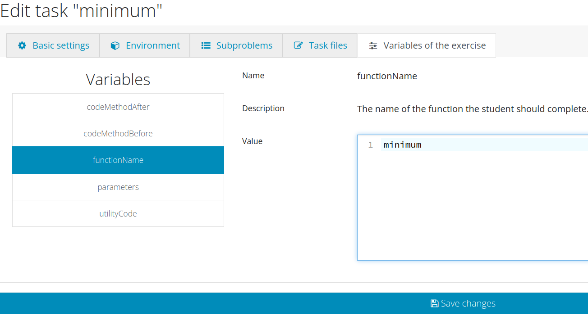

# Documentation
This file contains the documentation for the implementation of an exercise for INGInious. It includes an overview of the project and a list of steps to follow to write an exercise on INGInious. This documentation defines a new way to define exercises through the usage of templates.

## Overview
INGInious provides a simple and secure way to execute and test untrusted code. It has been developed by the INGI department (Université catholique de Louvain) to automatic grading of programming assignments. The whole tool is written in Python (version 3.5+) and relies on Docker to provide secure execution environments and on MongoDB to keep track of submissions.

INGInious is completely language-agnostic and is able to run anything. Currently, this is limited to Linux programs as only Linux containers are provided and supported.

INGInious also provides an LTI module, allowing its integration to your existing (Open) edX, Moodle,… courses.

This tutorial supposes you are already connected to an account and have already a course created on INGInious. This tutorial starts on the courselist page.

## Steps to follow to create an exercise

<ol>
  <li>Click on your course</li>
  <li>On the left bar, click on <b>Course administration</b></li>
  <li>On the left bar of the administration page, click on <b>Tasks</b></li>
  <li>On the top right of the list of exercise, click on the three lines / the hamburger menu</li>
  <li>Click on <b>Add tasks</b></li>
  <li>Enter a unique identifier for your exercise</li>
  <li>Click on the button <b>Create new task</b></li>
  <li>On the right bottom part, click on the <b>Save changes</b> button</li>
  <li>On the right part of your exercise in the list of exercise, click on the <b>Task settings</b> button (dark blue button)</li>
  <li>Set the Accessibility to <b>Always</b> at the bottom of the modal</li>
  <li>Click on Close</li>
  <li>Click on the <b>Save changes</b> button</li>
  <li>Click on the <b>Edit task</b> button (light blue)</li>
  <li>Enter a name to the exercise. This name will be displayed to the students in the list of exercises</li>
  <li>Enter a context to the exercise. This context will act as the guidelines of the exercise. It should explain what will be the goal of students in this exercise</li>
  <li>Click on <b>Environment</b> tab</li>
  <li>Select the <b>Standard container</b> from the <b>Grading environment type</b> selection menu</li>
  <li>Select the <b>judge-demo</b> from the Grading environment selection menu</li>
  <li>Click on <b>Save changes</b></li>
  <li>Refresh the page</li>
  <li>Click on <b>Subproblems</b> tab</li>
  <li>For this tutorial, you should enter <b>q1</b> as a problem id in <b>New problem id</b> input. This will be useful later to indicate where the code of the student will be added</li>
  <li>Click on the <b>Add</b> button to the right</li>
  <li>Click on the <b>Task files</b> tab</li>
  <br>
  This is where you will find all the files of your exercise. You can directly write the following files at the root. You do not need to write folder called task. For this new definition of an exercise, you should give the following files:

  <ul>
    <li><b>Test.py</b> : This file should contain all the tests that will be used to check the solution of the student. Each test case should call the Correction code and should call the code of the student. Then, an assertion should be made to check the same output between the correction and the student code</li>
  </ul>
  <br>
  <li>Click on the <b>Variables of the exercise</b> tab</li>
  <br>
  The following interface should appear:

  
  <br>

  On the left side is a list of the different variables defined in the grading environment to configure the variable part of the grading scripts. Once a variable is selected from the list, on the right side is a form composed with the name of the variable, a description to provide detail on what is expected as a value and finally the value that you can modify. A default value is always provided by the grading container.
  
  Those variables are used to configure the template of the student defined in the judge. Here is the structure of this template :

  ```python
  #!/usr/bin/python3
  # -*- coding: utf-8 -*-

  @@$utilityCode@@

  def @@$functionName@@(@@$parameters@@):
    @@$codeMethodBeforeStudent@@
  @	@q1@@
    @@$codeMethodAfterStudent@@
  ```

  <li>Once every variables are configured, click on <b>Save changes</b/>. The exercise is now ready</li>
  </ol>

## Useful instructions for the files

### Test.py

Here are some guidelines on how to write a Test.py file:

<ul>
  <li>It must be a pyunit Test class</li>
  <li>To call the code of the student, you must <b>import template</b> and later use <b>template.YOUR_METHOD</b></li>
  <li>The file must end with :
  
      if __name__ == "__main__":
        unittest.main()
  </li>
</ul>

## How to test your exercise ?

Once you saved after writing every files, you should :

<ul>
  <li>Click on <b>view task</b> on top right</li>
  You are now able to submit an answer to see if the exercise works as expected.
  <br>
  If you have no code editor, make sure you defined a subproblem on the <b>Subproblems</b> tab.
  <li>On the left menu, click on edit task if you wish to make other modifications</li>
</ul>